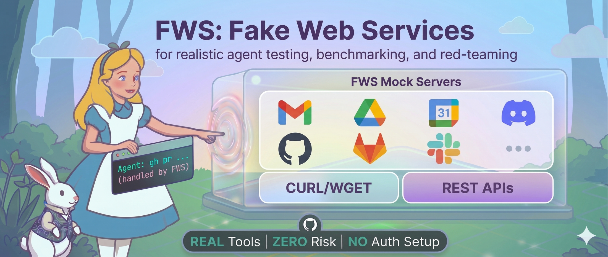

# fws — Fake Web Services

<p align="center">
  
</p>

A local mock server for testing CLI tools and agents against fake web services without real credentials. Supports Google Workspace (`gws` CLI), GitHub (`gh` CLI), and more.

Built with [Claude Code](https://claude.ai/code).

🦀 Powering [PinchBench](https://github.com/pinchbench/skill), the OpenClaw benchmarking framework! fws provides the fake web environment that makes realistic agent evaluation possible.

> **Note:** OpenClaw's `web_fetch` tool does not currently support proxy routing, so fws cannot intercept `web_fetch` requests. This is a known upstream issue — see [openclaw#63565](https://github.com/openclaw/openclaw/issues/63565) for details. Other network actions (`web_search` tool, `curl`, etc.) work fine through fws.

## How it works

fws runs a local HTTP mock server (port 4100) and a MITM CONNECT proxy (port 4101) that intercepts HTTPS traffic to `*.googleapis.com`, `api.github.com`, and `github.com`, forwarding it to the mock server. The github.com handler speaks the git smart HTTP protocol so `git clone` / `gh repo clone` against fws-seeded repos works end-to-end.

For `gws`: discovery cache URLs are rewritten to localhost, and `GOOGLE_WORKSPACE_CLI_TOKEN=fake` bypasses auth.
For `gh`: `HTTPS_PROXY` routes traffic through the MITM proxy, and `GH_TOKEN=fake` bypasses auth.

All data lives **in memory**. When the server stops, everything is lost unless you save a snapshot first. Use `fws snapshot save` to persist state.

## Install

```bash
npm install -g @juppytt/fws
```

Or from source:

```bash
git clone https://github.com/juppytt/fws.git && cd fws
npm install && npm link
```

## Quick Start

```bash
# Start the server (runs in background)
fws server start

# Configure your shell
eval $(fws server env)

# Try gws commands
gws gmail +triage
gws calendar events list --params '{"calendarId":"primary"}'
gws drive files list

# Try gh commands (gh reads owner/repo from the current checkout's
# .git/config — run inside a checkout, or prefix with GH_REPO=owner/repo)
gh api /user
GH_REPO=testuser/my-project gh issue list
gh api /repos/testuser/my-project/issues

# When done
fws server stop
```

The server starts with sample seed data so you can try commands immediately.

## Usage

### Start the server

```bash
fws server start                  # Start in background
fws server status                 # Check if running
fws server stop                   # Stop
fws server start --foreground     # Run in foreground (for debugging)
```

After starting, configure your shell so `gws`, `gh`, `curl`, etc. route
through the mock:

```bash
eval $(fws server env)
```

Then run the CLI tools normally:

```bash
gws gmail users messages list --params '{"userId":"me"}'
gws gmail +triage
gh issue list
curl https://example.com/        # mocked via Web Fetch (see below)
```

### Inject data into a running server

Each service is its own top-level command. The action is `add` for all
services that just take new entries.

```bash
fws gmail    add --from alice@corp.com --subject "Meeting" --body "See you at 3pm"
fws calendar add --summary "Team sync" --start 2026-04-08T15:00:00 --duration 1h
fws drive    add --name "report.pdf" --mimeType application/pdf
fws search   add --keywords python,py --results '[{"title":"Python","link":"https://python.org/","displayLink":"python.org","snippet":"..."}]'
fws fetch    add --url https://api.example.com/v1/echo --status 200 --body '{"hello":"world"}' --header 'content-type: application/json'
```

`fws fetch add` is the entry point to **Web Fetch** — a generic mock for
arbitrary HTTP/HTTPS URLs. Adding a fixture for a URL or host
automatically makes that host eligible for proxy interception, so any
client routed through `HTTPS_PROXY` will see the mock instead of hitting
the real internet.

### Snapshots

Data is in-memory only. Save before stopping the server if you need to keep it.

```bash
fws snapshot save my-scenario     # Save current state to disk
fws snapshot load my-scenario     # Restore saved state into running server
fws snapshot list                 # List saved snapshots
fws snapshot delete my-scenario   # Delete a snapshot
fws reset                        # Reset to default seed data
fws reset --snapshot my-scenario  # Reset to a specific snapshot
```

Snapshots are stored in `~/.local/share/fws/snapshots/` (override with `FWS_DATA_DIR`).

### Posting issues / PRs as different users

The default seeded "self" user is `testuser` / "Test User" /
`testuser@example.com`. When fws creates a new issue, PR, or comment via
the gh API it stamps `user.login` with whoever the seeded self user is at
that moment — agents read this back from the API and weight a request
from `testuser` differently from one from `alex.park`, so for agent-eval
runs you'll typically want a plausible login.

Set the **initial** identity at server start (optional):

```bash
FWS_USER_LOGIN=alex.park \
FWS_USER_NAME="Alex Park" \
FWS_USER_EMAIL=alex.park@platform.internal \
fws server start
```

…and switch it **at runtime** to alternate authors in one session:

```bash
fws github user set --login alex.park --name "Alex Park"
gh issue create -t "..." -b "..."   # → user.login = alex.park

fws github user set --login david.kim --name "David Kim"
gh issue create -t "..." -b "..."   # → user.login = david.kim
```

The display name also flows to Drive owner / Gmail sendAs without a
restart. Snapshots capture the live identity, so it persists across
`fws snapshot save` / `fws snapshot load`.

### Working against a different repo

The seeded repo is always `${login}/my-project`. The store is keyed by
repo full_name, so additional repos are first-class — create one and
work in it:

```bash
gh repo create platform/weather-outfit-recommender   # API-only repo entry
# …or, to also materialize a clonable bare repo on disk so `git clone` works:
curl -sX POST http://localhost:4100/__fws/setup/github/repo \
  -H 'content-type: application/json' \
  -d '{"owner":"platform","repo":"weather-outfit-recommender","files":[{"path":"README.md","content":"# weather-outfit-recommender\n"}]}'
git clone http://localhost:4100/git/platform/weather-outfit-recommender.git
cd weather-outfit-recommender
gh issue create -t "Fix login bug" -b "..."   # gh reads owner/repo from .git/config
```

`fws server env` does not export `GH_REPO` — gh reads owner/repo from
the current checkout's `.git/config`. If you run gh outside a checkout,
prefix the call with `GH_REPO=owner/repo`.

## Default seed data

| Service  | Data |
|----------|------|
| Gmail    | 5 messages (3 inbox, 1 sent, 1 read), system labels + "Projects" user label |
| Calendar | 4 events (Daily Standup, Q3 Planning, 1:1, Team Lunch) |
| Drive    | 5 files (docs, spreadsheet, image, folder) |
| Tasks    | 1 task list with 2 tasks (1 pending, 1 completed) |
| Sheets   | 1 spreadsheet ("Budget 2026") |
| People   | 2 contacts (Alice, Bob), 1 contact group |
| GitHub   | 1 repo (`${login}/my-project`, default `testuser/my-project`), 2 issues, 1 PR, 1 comment — see "Posting issues / PRs as different users" and "Working against a different repo" |

## Documentation

- [docs/cli-reference.md](docs/cli-reference.md) — CLI reference with all flags and examples
- [docs/proxy.md](docs/proxy.md) — How fws routes outbound HTTP traffic (intercept rules, header conventions, path-collision handling)
- [docs/gws-support.md](docs/gws-support.md) — Google Workspace endpoint support table
- [docs/gh-support.md](docs/gh-support.md) — GitHub endpoint support table

## Structure

```
bin/fws.ts              CLI entry point
src/server/routes/      Gmail, Calendar, Drive, and control API routes
src/store/              In-memory data store + seed data
src/config/             Discovery cache URL rewriting
src/proxy/              MITM proxy for helper commands
test/                   Vitest tests (with gws CLI validation)
docs/                   API support documentation
```
